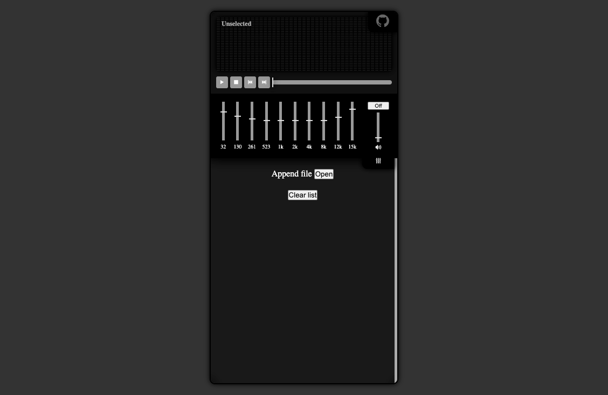
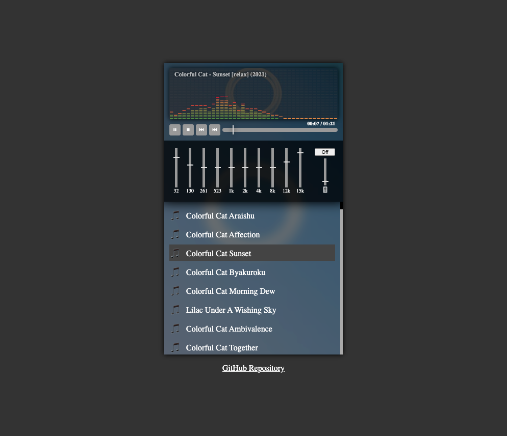
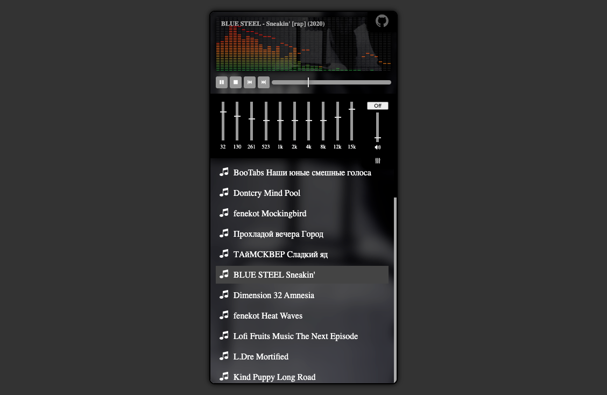

# My-Player

Easy mp3 web player

[Online demo](https://vicimpa.github.io/my-player)

## For development
```bash
> npm install
> npm run dev
```

### For build
```bash
> npm install
> npm run build
```

### Screens
>
> 
>
> 
>
> 
>